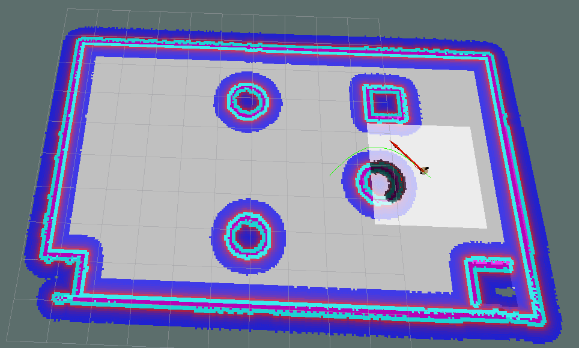

# 2024 RoboMaster JLU 校内赛 AI组考题

> 题目见 [题目详情](./Problems.md)

## 导读

### 1. 认识移动机器人

扫地机器人作为目前需求量最大的一种移动机器人，已成为一种比较常见的家用电器。    
目前中高端的扫地机器人已经配备了激光雷达、相机、超声波、红外等多种传感器，集成SLAM、路径规划、多传感器融合等众多算法，以确保在家庭的复杂环境中可以高效地完成工作。这样一个小小的扫地机器人，就是一个典型的移动机器人。

总的来说，移动机器人就是一个集 **感知、定位、决策、规划、控制、执行** 等多功能为一体的综合系统。

接下来，我们开始移动机器人原理的学习与应用。

### 2. ROS 机器人操作系统

**ROS（Robot Operating System）** 是一个标准软件平台，这个平台为开发者提供了构建机器人应用程序所需的各个功能模块，并且开发者能够以“可插拔”的方式组织各个功能模块，无论开发者的程序是用于课堂实验、科学研究、原型设计或是最终产品，ROS 都提供了一站式的技术支持。    
ROS 是开源的，它由一组软件库和若干工具组成，是通讯机制、工具软件包、机器人高层技能以及机器人生态系统的集合体。    

> 另外需要注意的是，ROS 虽然字面意思是机器人操作系统，但是它并非经典意义上的操作系统，更准确的讲 ROS 是一个 SDK（Software Development Kit）即软件开发工具包。

我们推荐安装和学习 **ROS2 Humble** ，并通过 **题目一至题目四** 考查大家对 ROS 通信机制的掌握程度。

### 3. 感知定位

感知指利用传感器获取外界环境信息，判断周围有没有要识别的目标或障碍物等，常用的传感器有超声波雷达、毫米波雷达、激光雷达、相机等。定位则是通过传感器数据来获取自身在环境中的位置与姿态，通常采用GNSS、RTK、IMU、轮速计、视觉里程计/激光雷达里程计等方案。

> 通常感知与定位是绑定在一起的，如专门有个领域叫作 **SLAM (Simultaneous Localization and Mapping)** ，即同时定位与地图构建。SLAM 可以分为以下两部分：Localization，在给定地图的情况下估计机器人的位姿；Mapping，在给定机器人位姿的情况下估计环境地图。由于 SLAM 需要一定的数理基础，我们不做考查。

我们使用相机获取图像数据来搜寻、识别和预测环境中其他机器人(以及其他需要击打的目标)的位姿，从而进行敌我识别、自动瞄准和精确击打。这部分工作由视觉组的同学们负责，我们不做考查。但为了更高效的合作，大家在日后的学习与备赛工作中也需要了解这方面知识。

我们使用激光雷达获取点云数据来识别和处理地面和障碍物信息，从而进行实时定位、自主避障和地图构建。在将点云数据输入给某些算法之前需要对点云进行一些预处理。我们推荐学习 **PCL (Point Cloud Library)** 库，并以附加题形式通过 **题目八** 鼓励大家了解点云及其处理方法。

### 4. 决策规划

如果将感知定位模块比作人的眼睛和耳朵，控制执行模块比作手和脚，那么决策规划模块就是大脑。大脑在接收到各种环境感知信息和自身定位信息后，对当前环境作出分析决策，规划出行进路径，然后对底层执行模块下发指令。决策规划模块可以处理多么复杂的场景，是衡量和评价移动机器人的最核心指标之一。    
典型的决策规划模块可以分为三个部分，即 **行为决策(Behavioral Planning)、路径规划(Route Planning)、运动规划（Motion Planning）** 。

> 行为决策：决定自己要做什么，结合环境感知信息、比赛规则信息、机器人自身状态信息等，综合决策出下一时刻要去哪里、做什么。行为决策只给出运动意图，并不给出具体的运动建议，至于机器人要走哪条路线、速度给多少等，那是规划和控制的事。    
> 路径规划：又叫全局规划，规划相对顶层，静态。在接收到目标点信息后，基于存储的地图信息搜索出一条自起始点到目标点的可通过的路径。当然路径不止一条，我们要通过算法搜索出最优的路径。    
> 运动规划：又叫局部规划，这是相对全局规划而言的。动态规划，要求快速响应。结合机器人自身信息、局部环境信息、全局路径参考信息等，规划出一条满足特定约束条件的平滑轨迹，并生成控制信息下发给执行模块。需要注意的是，在 Nav 2 中，运动规划器被称作控制器。

我们通过 **题目五** 考查大家对 **路径规划** 算法的了解;    
通过 **题目六** 考查大家对 **行为决策** 方法的了解;    
通过 **题目七** 来让大家尝试部署 **Navigation 2** 这一集成了行为决策、路径规划、运动规划等多个模块的开源机器人导航系统。

### 5. 控制执行

想让机器人动起来，电机自然是必不可少。执行实际上就是 MCU 接收上位机指令后驱动电机控制机器人底盘、云台、机械臂等部位执行相应动作。以机器人底盘为例，底盘通常由电机、调速器、编码器等组成。控制底盘移动是通过控制轮速差异来实现的，这就需要执行模块将我们下发的线速度与角速度指令解算为轮速，实现机器人的各种直线/曲线和转向运动。

这部分工作由电控组的同学们负责，我们不做考查。但为了更高效的合作，大家在日后的学习与备赛工作中也需要了解这方面知识。

### 6. 仿真与可视化

仿真在机器人研发过程中占有举足轻重的地位，在研发与测试中较之于实体机器人实现，仿真有着低成本、高效、高安全性等显著优势。

ROS 提供了多种工具，可以满足我们的可视化显示、三维仿真等开发需求，涉及的内容主要有三：对机器人建模( **URDF** )、搭建仿真环境( **Gazebo** )以及信息可视化( **Rviz、rqt** )等。

我们以附加题形式通过 **题目九** 鼓励大家了解 ROS 中的机器人与环境 **仿真** 以及信息 **可视化** 。

 

**考核题目详见** [题目详情](./Problems.md)
