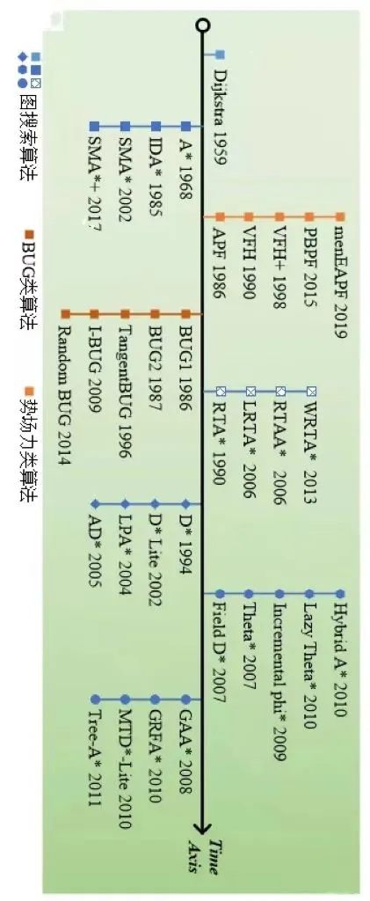
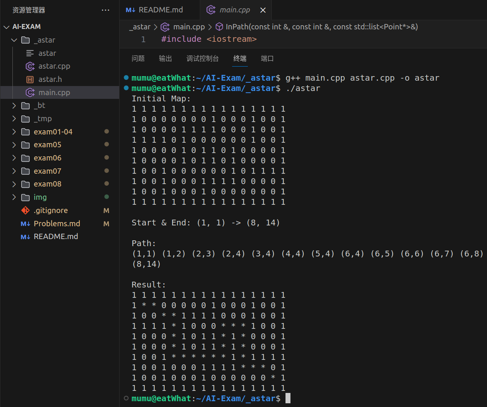

# Tips💡

## 关于路径规划

路径规划，就是机器人在遵循一些优化指标（如时间最短、路程最优、能耗最低）的前提下，在环境中规划出从起始点到目标点的可通过的不发生碰撞的最优路径。

路径规划在机器人系统开发中具有很高的重要性，原因有以下几点：

> 安全：路径规划能够规避障碍物，防止机器人在移动过程中发生碰撞。    
> 高效：通过计算出最优路径，提高机器人执行任务的效率。    
> 动态：考虑环境的动态变化，实现实时路径重规划，提高机器人的环境适应性。

根据算法特性划分，大致有图规划算法、空间采样算法、曲线插值拟合算法和仿生智能算法等几类。    
较为经典的是图规划算法，将环境离散化表达（如栅格图），对离散节点描述其相应状态，建立节点间联系，并求解最优路径。图规划算法根据生成路径的方式又可分为三类，其中以图搜索算法为主，以及BUG算法和势场力算法。

基于搜索的规划算法已经比较成熟且得到了广泛应用，建议大家从图搜索算法入手学习路径规划算法，例如 **A\*** 算法。

 

## 教程推荐

[2D导航原理系列教程合集](https://www.bilibili.com/video/BV19b4y1d7Hz/)

> B站 轮趣科技的2D导航教程

[zhm-real/PathPlanning](https://github.com/zhm-real/PathPlanning)

> 一个带有演示动画的常用路径规划算法仓库。

[redblobgames](https://www.redblobgames.com/)

> 一些十分有助于理解算法的带有可互动动画的教程。

关于 A* 算法，网上有许多教程，大家自行查阅。

 

## 关于本题

基本实现 A* 算法，地图自行设计。

> 要求:    
> 1.封装成类    
> 2.分成 .h 和 .cpp    
> 3.代码适当注释

**Example:**

(1表示障碍物，0表示可通过区域, *表示路径)

