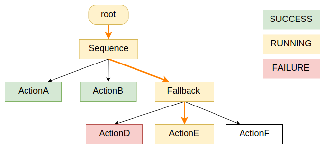

# Tips💡

## 关于行为决策

要让机器人完成自主决策，主要有两种方法： **状态机 (FSM)** 和 **行为树 (Behavior Tree)** 。

> 理论上，行为树和状态机具有相同的表达能力，可以实现相同的功能。    
> 行为树更好还是状态机更好主要看所要定义的行为是更偏向模块化，还是更偏向反应式。一般来说，行为树更方便进行模块化组合和修改，状态机更方便进行反应式动作设计。

我们使用行为树来使机器人进行行为决策。

 

## 教程推荐

[aisharing 1](http://www.aisharing.com/archives/90)

[aisharing 2](http://www.aisharing.com/archives/99)

[aisharing 3](http://www.aisharing.com/archives/280)

> http://www.aisharing.com 这是个很好的AI相关的博客分享网站

 

## 关于本题

使用开源行为树框架，设计一个简单的行为树。

推荐开源行为树框架：[BehaviorTree.CPP](https://github.com/BehaviorTree/BehaviorTree.CPP)

对应教程：[BehaviorTree.Dev](https://www.behaviortree.dev/docs/Intro)

**Example:**

