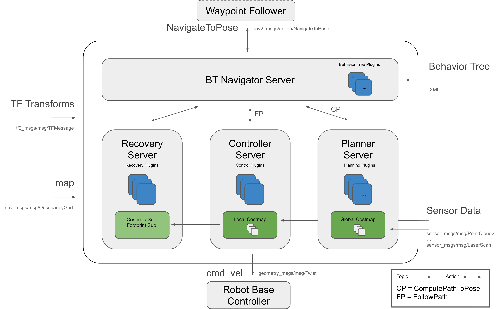

# Tips💡

## 关于 Navigation 2

### Nav 2 是什么

Navigation 2 (以下简称Nav 2) 项目继承并发扬 ROS Navigation Stack 的精神。该项目力求以安全的方式让移动机器人从A点移动到B点。Nav 2 也可以应用于其他应用，包括机器人导航，如动态点跟踪，在这个过程中需要完成动态路径规划、计算电机的速度、避免障碍、恢复行为。

### Nav 2 怎么做

Nav 2 使用行为树调用模块化服务器来完成一个动作。动作可以是计算路径、控制力、恢复或任何其他与导航相关的操作。这些都是通过 ROS Action 服务器与行为树 (BT) 通信的独立节点。下图可以让你对 Nav 2 的架构有一个初步了解。

### 四个服务

对上面的架构图进一步地进行解释，可以简单分为四个服务。

**BT Navigator Server** (导航行为树服务)，通过这个大的服务来进行下面三个小服务组织和调用。

**Planner Server** (规划器)，其任务是计算完成一些目标函数的路径。根据所选的命名法和算法，该路径也可以称为路线。说白了就是在地图上找路。

**Controller Server** (控制器)，在 ROS 1 中也被称为局部规划器，是我们跟随全局计算路径或完成局部任务的方法。说白了就是根据找的路控制机器人走路。

**Recovery Server** (恢复器)，恢复器是容错系统的支柱。恢复器的目标是处理系统的未知状况或故障状况并自主处理这些状况。说白了就是机器人可能出现意外的时候想办法让其正常，比如走着走着掉坑如何爬出来。

通过规划路径、控制机器人沿着路径运动、遇到问题自主恢复三者进行不断切换完成机器人的自主导航（在这个过程还需要很多节点和数据的辅助）。

 

## 相关链接

[Nav 2 Doc](https://navigation.ros.org/)

> Nav 2 官方文档，如安装说明、教程、指南等。

[Nav 2 Github](https://github.com/ros-planning/navigation2)
> Nav 2 源码 Github仓库

 

## 教程推荐

**文档：**

[Nav 2 中文文档](http://dev.ros2.fishros.com/doc/)

> 由鱼香ROS-Nav2开源小组成员及机器人爱好者提供

[动手学ROS2](https://fishros.com/d2lros2/#/)

> 鱼香ROS

**视频：**

[3分钟学会Nav2的安装和使用](https://www.bilibili.com/video/BV1wu4y137fX/) 🥹

 

## 关于本题

实现机器人在仿真环境中移动至任一目标点即视为完成任务。

**分值设置：**

|                          |    |
|--------------------------|----|
| 可在Gazebo中显示仿真环境    | 6  |
| 可在Gazebo中显示机器人模型  | 6  |
| 可在Rviz中显示规划出来的路径 | 6  |
| 机器人可移动至目标点        | 6  |
