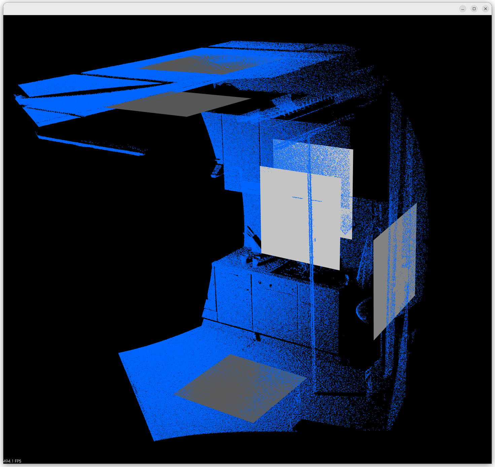
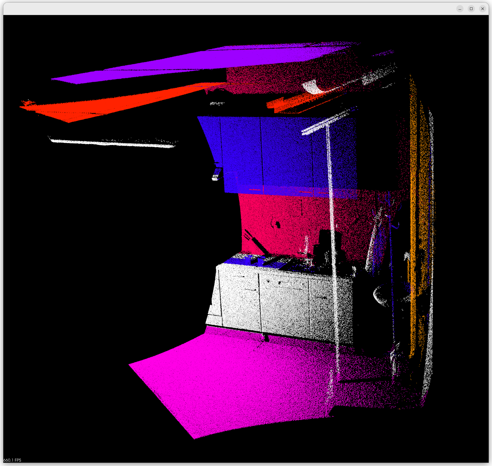

# Tips💡

## 关于 PCL

点云数据的处理可以采用获得广泛应用的 **PCL (Point Cloud Library)** 。PCL库是一个最初发布于2013年的开源 C++ 库。它实现了大量点云相关的通用算法和高效的数据管理。如果说 OpenCV 是2D信息获取与处理的技术结晶，那么 PCL 在3D信息获取与处理上，就与 OpenCV 具有同等地位。

 

## 教程推荐

[CSDN](https://blog.csdn.net/qq_42994487/article/details/130628125)

[语雀](https://www.yuque.com/huangzhongqing/pcl)

[博客园](https://www.cnblogs.com/li-yao7758258/category/954066.html)

[PCL 官网](https://pointclouds.org/)

 

## 关于本题

**Example:**

(示例图片为对 kitchen 进行平面可视化的两种方式)

|  |  |
|--|--|
|||
