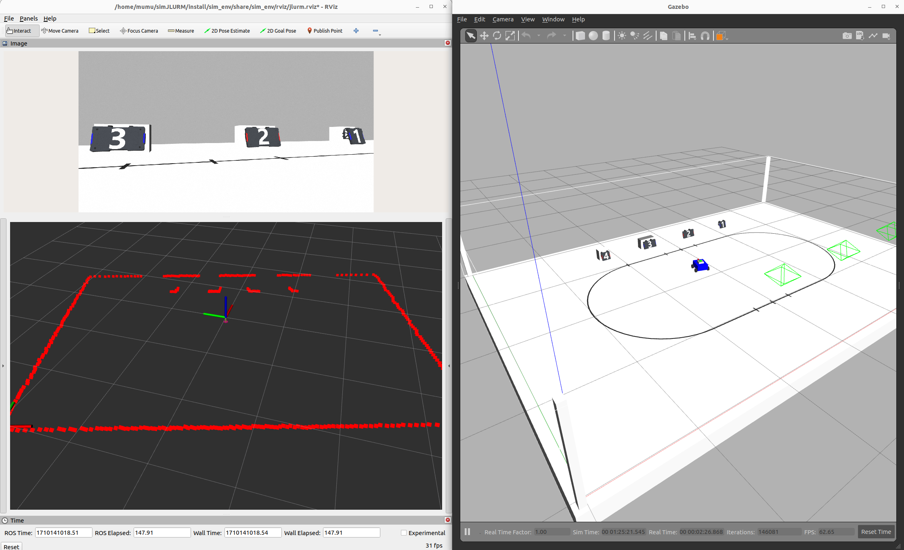
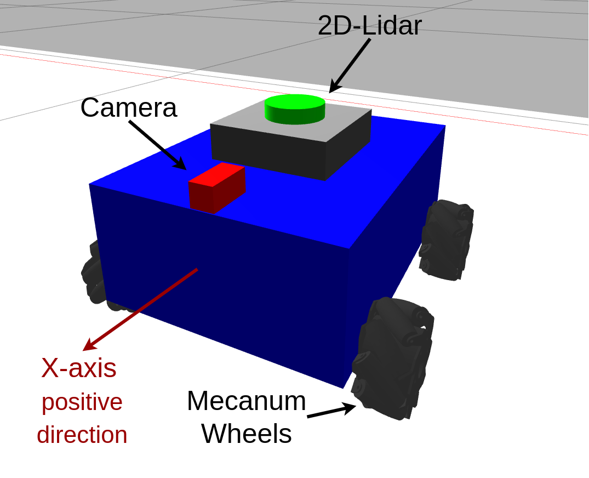

# 2024 JLURM Simulation Environment

## 1. 简介

为了方便AI组与视觉组同学测试代码与联调，我们提供此模拟器。



文件目录如下：

```txt
├── CMakeLists.txt
├── sim_env    # 机器人模型&仿真环境
│   ├── launch           # launch文件
│   │   ├── sim_armor.launch.py         # 装甲板环境
│   │   └── sim_color_num.launch.py     # 纯色块&数字标签环境
│   ├── maps             # 保存的地图
│   ├── meshes           # 模型资源
│   │   ├── mecanum_wheel               # 麦克纳姆轮模型
│   │   └── SIM2024JLURM                # 校内赛场地模型
│   ├── rviz             # Rviz config
│   ├── urdf             # 机器人描述文件
│   │   └── sampleROBOT                 # 示例机器人
│   └── world            # 仿真环境描述文件
│       ├── SIM2024JLURM                # 校内赛仿真环境
│       └── empty_world.world           # 空环境
├── tools      # 工具
│   ├── openslam_gmapping      # slam_gmapping依赖 
│   └── slam_gmapping          # gmapping for ros2
└── package.xml
```

## 2. 依赖

### Ubuntu 22 & ROS Humble

本人仅在以上环境中测试过此模拟器。

### Gazebo Classic & gazebo-ros

```bash
sudo apt install ros-humble-gazebo-ros
```

## 3. Build

```bash
mkdir -p YOUR_WORKSPACE/src
cd YOUR_WORKSPACE/src
## 将sim_env和tools放入此目录
cd ..
colcon build --symlink-install
```

## 4. Run

启动纯色块&数字标签环境：

```bash
. install/setup.bash
ros2 launch sim_env sim_color_num.launch.py
```

启动装甲板环境：

```bash
. install/setup.bash
ros2 launch sim_env sim_armor.launch.py
```

## 5. 关于小车

### 结构



### 控制

如果你想手动控制小车运动：

```bash
sudo apt install ros-humble-teleop-twist-keyboard
ros2 run teleop_twist_keyboard teleop_twist_keyboard
```

```txt
This node takes keypresses from the keyboard and publishes them as Twist messages.
---------------------------
Moving around:

   U    I    O
   J    K    L
   M    <    >

q/z : increase/decrease max speeds by 10%
w/x : increase/decrease only linear speed by 10%
e/c : increase/decrease only angular speed by 10%

anything else : stop
```

### Odom

OdomTopic&OdomTF 由机器人模型提供。如果你不想从机器人模型获取 Odom，可修改 `YOUR_WORKSPACE/src/sim_env/urdf/sampleROBOT/move.xacro` 中的这两行:

```xml
<publish_odom>false</publish_odom>
<publish_odom_tf>false</publish_odom_tf>
```

## 6. Gmapping

建图：

```bash
. install/setup.bash
ros2 launch slam_gmapping slam_gmapping.launch.py
```

```bash
ros2 run teleop_twist_keyboard teleop_twist_keyboard
```

保存地图：
```bash
ros2 run nav2_map_server map_saver_cli -f MAP_NAME
```

## 7. Reference

[SLAM Gmapping](https://github.com/Project-MANAS/slam_gmapping): SLAM Gmapping for ROS2.

## 8. DO NOT Contact me

I am getting sick. If you have any questions about this work, please feel free to contact Mr. Suncy.